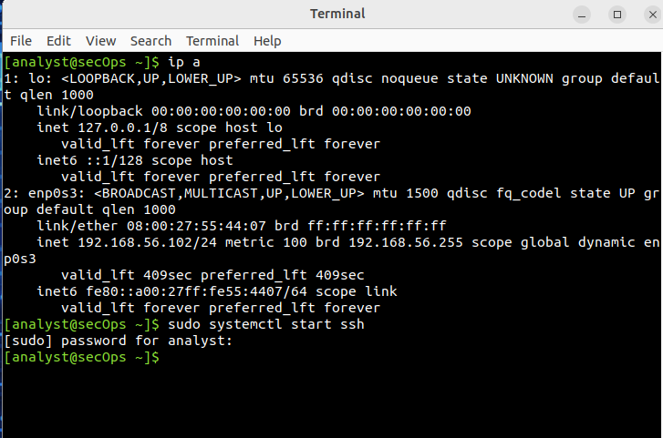
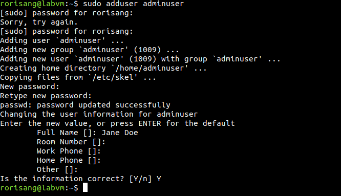
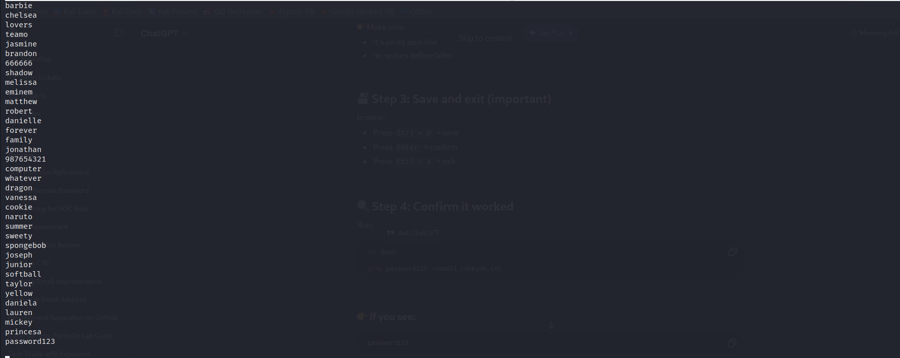
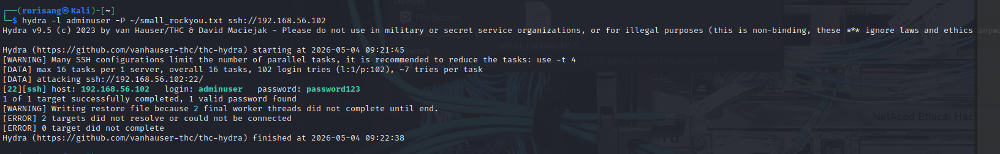
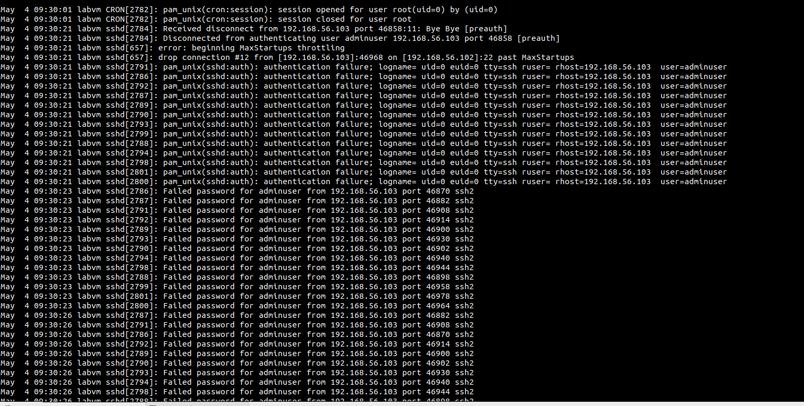
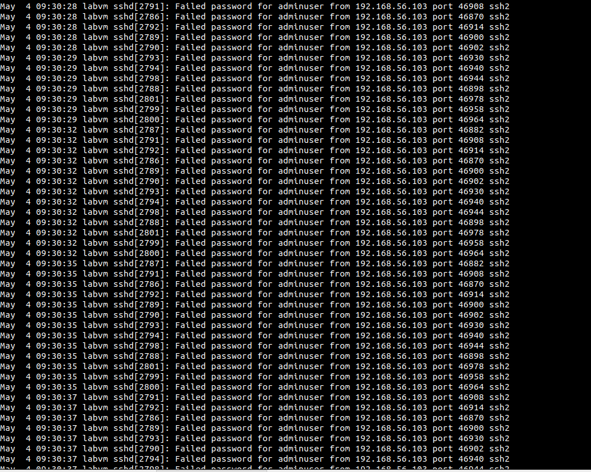
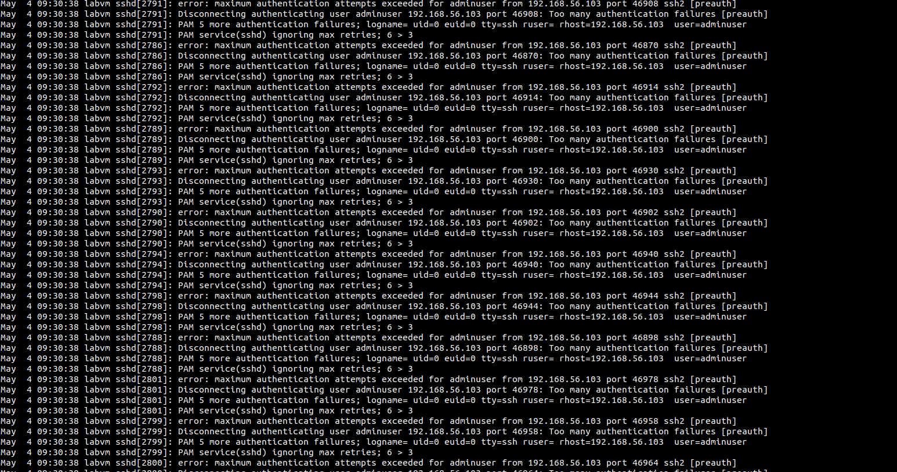
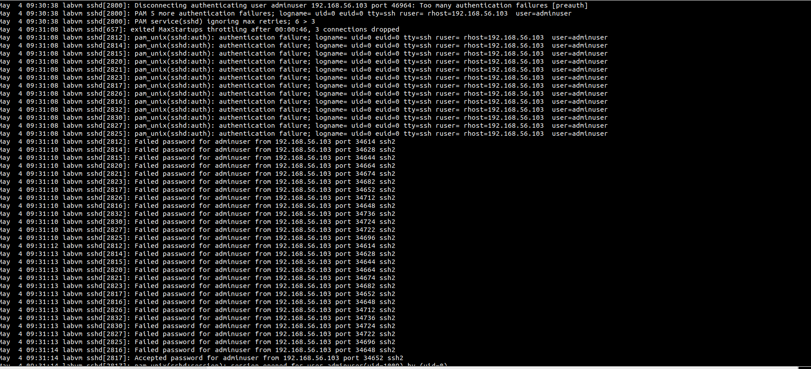
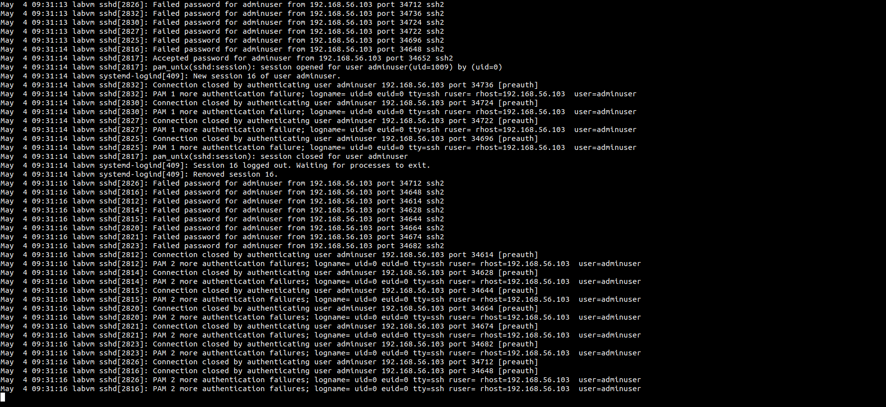

### SSH Brute Force Attack Simulation & Log Analysis

#### Scenario

An SSH brute-force attack was simulated against a Linux host to replicate a common credential-based intrusion attempt. The objective was to analyse authentication logs and identify indicators of compromise from a SOC perspectiv

#### Incident Summary

A high volume of failed SSH login attempts was observed targeting the user account adminuser. The activity originated from a single source IP and occurred within a short time window. The attack resulted in a successful login after the correct password was identified.

---

#### Environment Setup

* Attacker: Kali Linux
* Target: Ubuntu Cybersecurity VM
* Network: Host-only (192.168.56.0/24)

 **Network / IP Configuration and enablement of SSH**
 

*  IP = 192.168.56.102

---

#### User & Service Configuration

 Created a target user for the attack:

---

#### Wordlist Preparation

A smaller wordlist was created from the rockyou dataset:

---

#### Brute Force Attack

Hydra was used to perform the attack:

Success indicated as shown above by:

  * `login: adminuser`
  * `password: password123`

---

#### Log Analysis

Authentication logs were monitored during the attack:

  

  

  

 
 

* Shows repeated:

  * `Failed password`
  * same IP address

  * `Accepted password for adminuser`
---

#### Analysis

**Identified Indicators**

1. Repeated Failed password entries for a single user account
2. High frequency of login attempts within seconds (indicative of automation)
3. All attempts originating from a single IP address
4. SSH service generating rate-limiting messages (MaxStartups throttling)
5. A subsequent Accepted password entry confirming successful authentication

These indicators collectively point to a brute-force attack targeting weak credentials.
---

#### Threat Assessment
- The attack targets authentication mechanisms rather than software vulnerabilities
- Use of commonly known passwords increases likelihood of success
- Even with built-in SSH protections, persistent attempts can result in compromise
- Successful authentication grants the attacker direct system access

Impact:

Unauthorised system access
Potential lateral movement within the network
Risk of data exposure or system manipulation
---

#### Evidence Reviewed
- SSH authentication logs (/var/log/auth.log)
- Source IP address of attack traffic
- Volume and frequency of login attempts
- Successful authentication event

The analysis focused on identifying patterns consistent with automated password guessing.

---

#### Attack Flow (Applied Analysis)

The attack can be summarised as follows:

1. Target identification (SSH service exposed)
2. Credential guessing using a wordlist of common passwords
3. Repeated authentication attempts (automation)
4. Rate limiting triggered by SSH service
5. Successful login after correct password discovery

This reflects a typical brute-force attack lifecycle.

---

#### SOC Triage Output

**Alert Type**: SSH Brute Force Attack
**Category**: Credential Access
**Severity**: High
**Priority**: High

**Analysis Summary**:
Multiple failed SSH authentication attempts were observed from a single source IP, followed by a successful login. The pattern indicates an automated brute-force attack leveraging commonly used passwords.

**Recommended Action:**

 - Investigate the source IP address
 - Disable or reset compromised account credentials
 - Review system activity following the successful login
  - Block or restrict offending IP if malicious

**Justification:**

The presence of a successful login following repeated failures indicates a confirmed compromise, significantly increasing risk.

---

#### Recommended Response Actions

- Immediately reset credentials for affected accounts
- Enforce strong password policies
- Disable password-based SSH authentication and implement key-based access
- Deploy intrusion prevention tools such as Fail2Ban
- Monitor authentication logs for similar patterns

---

#### Detection & Prevention Insights

- Brute-force attacks can be identified through high volumes of failed login attempts
- Log monitoring is critical for early detection
- Weak passwords remain a major security risk
- Rate limiting alone is insufficient without stronger controls

---

#### Conclusion

This simulation demonstrates how brute-force attacks are executed and how they manifest in system logs. The exercise highlights the importance of strong authentication controls and continuous monitoring in preventing credential-based compromises.

