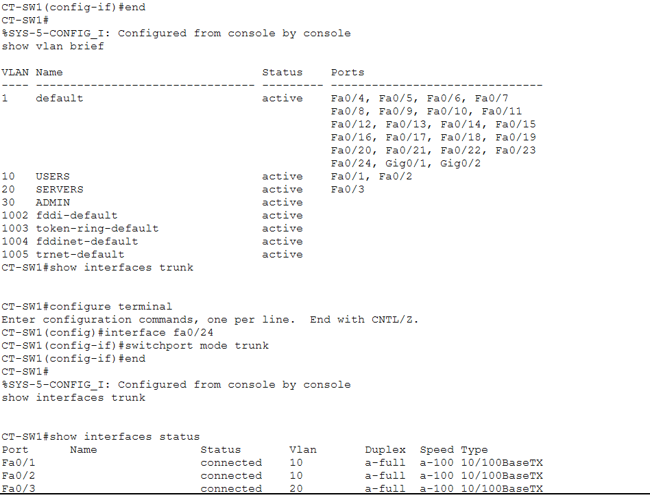
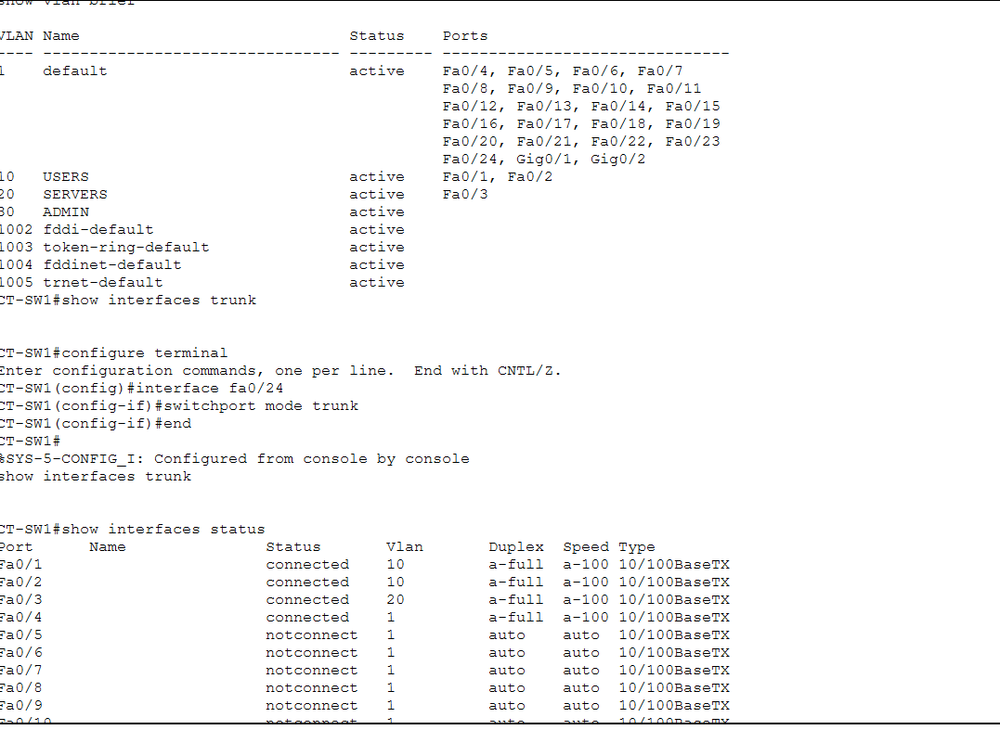
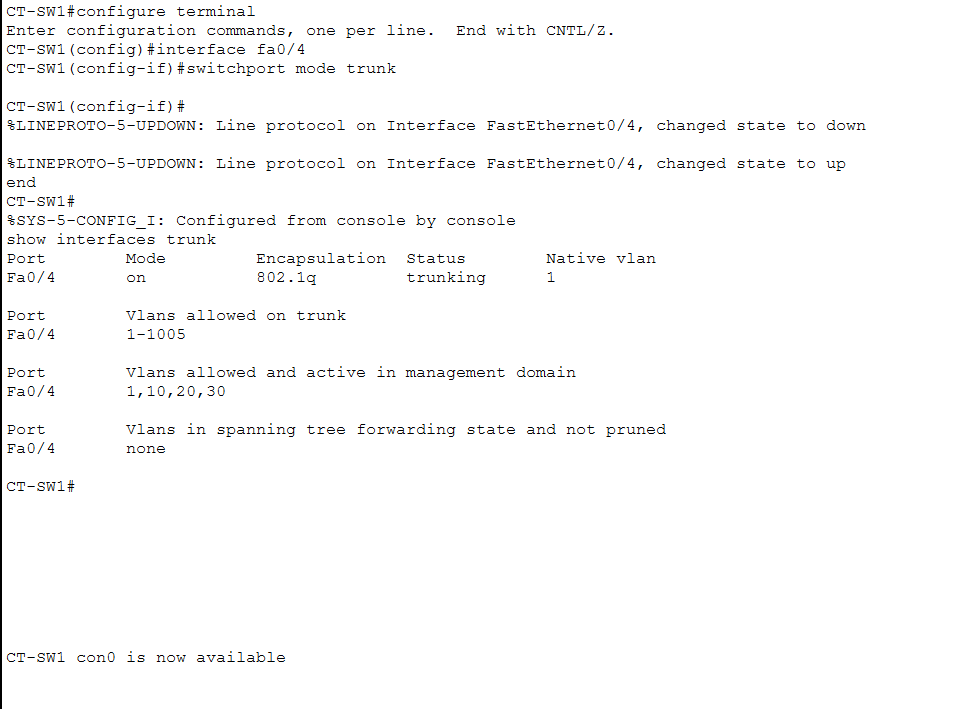

# Enterprise Network Segmentation Lab

## Overview

Built a segmented enterprise-style network in Cisco Packet Tracer using VLANs, trunking, and router-on-a-stick inter-VLAN routing.

The lab includes:
- VLAN segmentation
- Inter-VLAN communication
- Static IP configuration
- 802.1Q trunking
- Router subinterfaces
- Network troubleshooting

---

# Network Topology

![Enterprise Network Topology]network-security\images\network topology.png

---

# IP Addressing

| Device | VLAN | IP Address | Gateway |
|---|---|---|---|
| EMP-WS01 | 10 | 10.10.10.10 | 10.10.10.1 |
| ATT-WS01 | 10 | 10.10.10.20 | 10.10.10.1 |
| APP-SRV01 | 20 | 10.10.20.30 | 10.10.20.1 |

---

# Endpoint Configuration

## EMP-WS01

Configured as an employee workstation in VLAN 10.

---

## ATT-WS01

Configured as a second workstation to simulate another internal user/attacker.

---

## APP-SRV01

Configured inside the server VLAN.

---

# VLAN Configuration

Created separate VLANs for users, servers, and admin traffic.

| VLAN | Name |
|---|---|
| 10 | USERS |
| 20 | SERVERS |
| 30 | ADMIN |

---

# Port Assignments

Assigned switch ports to the correct VLANs.

| Interface | Assignment |
|---|---|
| Fa0/1 | VLAN 10 |
| Fa0/2 | VLAN 10 |
| Fa0/3 | VLAN 20 |
| Fa0/4 | Trunk Port |

---

# Router Configuration

Configured router-on-a-stick inter-VLAN routing using subinterfaces.

## Initial Router Setup

---

## Subinterface Configuration

Configured:
- GigabitEthernet0/0.10
- GigabitEthernet0/0.20

Used 802.1Q encapsulation for VLAN tagging.

---

## Interface Verification

Verified interfaces were operational and assigned correctly.

---

# Troubleshooting

Inter-VLAN communication initially failed.

Troubleshooting included:
- checking VLAN assignments
- verifying trunk configuration
- checking interface states
- validating router subinterfaces

---

## VLAN Verification

---

## Interface Verification

---

## Trunk Resolution

The issue was caused by the trunk configuration between the switch and router.

After reconfiguring the trunk port, inter-VLAN communication succeeded.

---

# Connectivity Testing

Successful communication between VLANs after troubleshooting.

---

# Skills Demonstrated

- VLAN segmentation
- Inter-VLAN routing
- Cisco switch configuration
- Router subinterfaces
- 802.1Q trunking
- Network troubleshooting
- Enterprise network design

---

# Security Relevance

Network segmentation reduces lateral movement and isolates critical systems from user devices.

This is commonly used in enterprise environments to improve:
- access control
- monitoring
- containment
- infrastructure security
